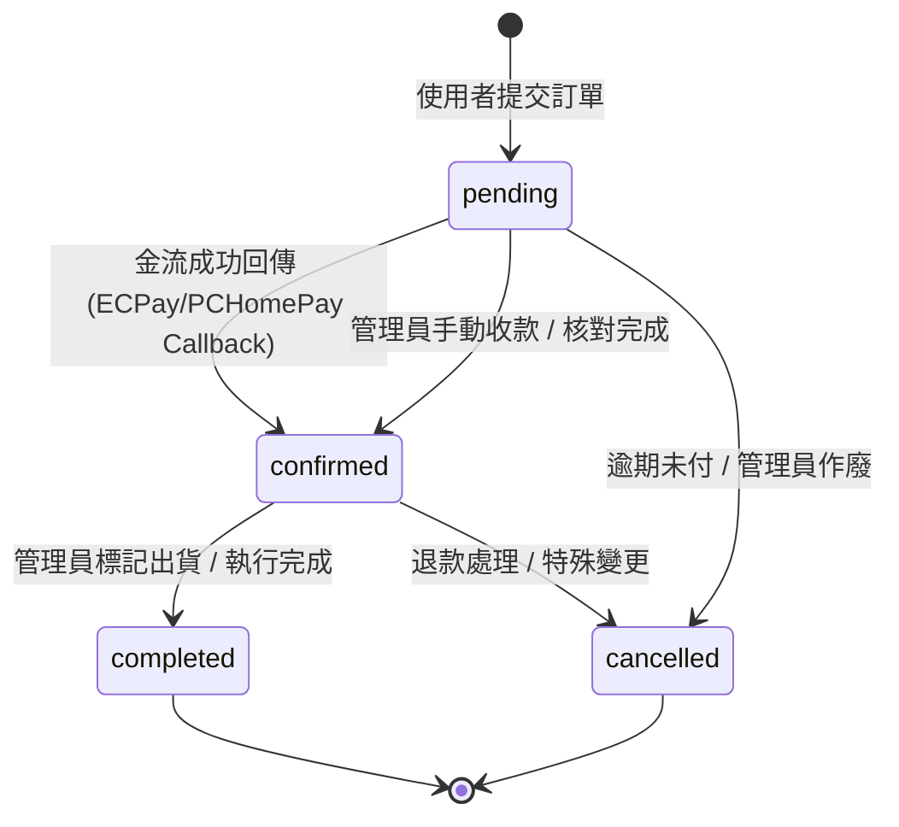

# KEICHA 系統狀態機定義 (State Machine Definition)

本文件定義 KEICHA 專案中各類型資料的合法狀態及其轉換邏輯，確保前後端行為一致。

## 1. 訂單狀態 (Orders, Denwa, CardLinks)

適用於 `orders`, `denwa_orders`, `card_orders` 集合。

### 1.1 狀態定義

| 狀態鍵值 (Key) | 顯示名稱 (Label) | 顏色 | 說明 |
| :--- | :--- | :--- | :--- |
| `pending` | 待處理 | 灰色 | 會員提交訂單後的初始狀態，等待付款或審核。 |
| `confirmed` | 已確認 | 綠色 | 支付成功 (由 ECPay/PCHomePay 回傳) 或管理員手動確認。 |
| `completed` | 已完成 | 綠色 | 商品已出貨或代撥服務已完成，流程結束。 |
| `cancelled` | 已取消 | 紅色 | 使用者主動取消、或因逾期、異常被管理員作廢。 |

### 1.2 狀態轉換圖

---

## 2. 配置與資源狀態 (Configuration States)

適用於 `card_orders_links`, `matcha_products`, `matcha_brands`, `denwa_plans`。

### 2.1 狀態定義

| 狀態鍵值 (Key) | 顯示名稱 (Label) | 顏色 | 說明 |
| :--- | :--- | :--- | :--- |
| `available` / `ON` / `active` | 啟用中 | 綠色 | 資源對外公開，可被使用者查閱或下單。 |
| `out-of-stock` | 缺貨中 | 橙色 | 資源暫時無法下單 (僅適用於商品/方案)。 |
| `discontinued` | 已停用 | 灰色 | 資源已下架，不再顯示於前端。 |

---

## 3. 實作規範 (Implementation Guidelines)

1.  **前端顯示**：必須透過 `js/status-config.js` 的 `getStatusBadge()` 函式生成標籤，禁止在頁面中硬編碼 (Hard-code) 狀態字串。
2.  **後端寫入**：在 `gas/firebase_handler.gs` 中更新狀態時，應確保寫入的是上述定義的 Key 值。
3.  **一致性映射**：
    *   歷史資料中的 `paid` 字串應在讀取時自動映射為 `confirmed`。
    *   `js/status-config.js` 負載所有對應關係。

---
最後更新時間：2026-03-04
