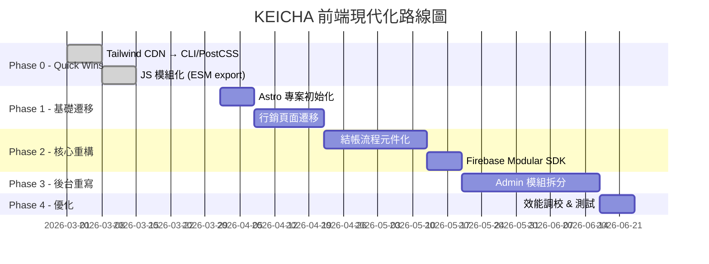

# KEICHA 前端框架技術診斷與遷移評估報告

> **報告日期**：2026-03-04  
> **分析範圍**：`keicha2025.github.io` 全站前端架構  
> **報告人**：資深前端架構顧問  
> **分類**：技術決策文件 (ADR)

---

## 摘要 (Executive Summary)

KEICHA 目前採用 **Jekyll 3.9 + Tailwind CDN + Vanilla JS + Firebase SDK (v9 compat)** 的無框架靜態站點架構。專案已成長至 **~16,200 行 HTML**（含 29 個頁面檔案），單一關鍵檔案 `admin.html` 已膨脹至 **5,948 行 / 280KB**。此架構在初期快速迭代階段具有優勢，但隨著功能密度持續攀升，已觸及**結構性天花板**。

**核心結論**：建議採用**漸進式遷移策略**，短期優化現有架構，中期將核心互動流程抽離至輕量級框架（推薦 **Astro + Islands Architecture**），長期完成全站元件化轉型。

---

## 1. 現狀審核 (Current State Audit)

### 1.1 技術棧盤點

| 維度 | 現狀 | 風險等級 |
| :--- | :--- | :---: |
| **靜態生成器** | Jekyll 3.9.5 (Ruby) | 🟡 中 |
| **CSS 框架** | Tailwind CDN (Runtime JIT) | 🔴 高 |
| **JavaScript** | Vanilla JS (ES6+, 無模組化) | 🔴 高 |
| **UI 元件庫** | 自建 KUI Dialog (`ui-dialog.js`) | 🟡 中 |
| **後端整合** | Firebase SDK v9 compat + GAS REST | 🟢 低 |
| **部署平台** | GitHub Pages (Jekyll) + Firebase Hosting | 🟢 低 |
| **CSS 設計系統** | `global.css` + inline `<style>` | 🟡 中 |

### 1.2 技術債評估

#### 🔴 關鍵風險 (Critical)

| 問題 | 影響 | 數據佐證 |
| :--- | :--- | :--- |
| **Tailwind CDN 模式** | 生產環境載入完整 Tailwind runtime (~300KB+)，無 Tree-shaking、無 PurgeCSS。Google 已明確表示 CDN 模式不適用於生產環境。 | 每次頁面載入額外 300KB+ JS 開銷 |
| **巨型單檔案 (God File)** | `admin.html` 達 5,948 行 / 280KB，包含 HTML + CSS + JS 全部邏輯。維護成本呈指數級增長，無法進行程式碼分割。 | 單檔 280KB，佔全站 HTML 40% |
| **零模組化 JS** | 所有 JS 檔案為全域腳本（無 `import`/`export`），依賴 `window.*` 掛載。無法進行 Tree-shaking、Lazy Loading 或單元測試。 | `js/` 目錄 7 檔 / 836 行，但 14,000+ 行 JS 散落在 HTML 的 `<script>` 內 |

#### 🟡 中度風險 (Medium)

| 問題 | 影響 |
| :--- | :--- |
| **Jekyll 3.x 版本老化** | Jekyll 3.9 使用 Ruby，社群活躍度持續下降。GitHub Pages 預設支持但功能受限（不支援自訂 plugin）。 |
| **CSS-in-HTML 氾濫** | 大量 `<style>` 區塊在業務頁面中（如 `card-order.html` 約 130 行 inline CSS），與全域 `global.css` 產生優先級衝突。 |
| **Firebase SDK compat 模式** | 使用 v9 compat（向下兼容 v8 API），無法享受 v9 Modular SDK 的 Tree-shaking 優勢（firebase compat 完整包約 200KB+）。 |

### 1.3 開發者體驗 (DX) 評分

| 指標 | 評分 | 說明 |
| :--- | :---: | :--- |
| **熱重載 (HMR)** | ⭐⭐ | Jekyll `serve --livereload` 僅支援全頁重載，無元件級 HMR。 |
| **TypeScript 支援** | ⭐ | 完全不支援。所有業務邏輯為未型別的 Vanilla JS。 |
| **程式碼導航** | ⭐ | 5,948 行的 `admin.html` 中搜尋函式需依賴全文搜尋，無法利用 IDE 的「跳轉定義」功能。 |
| **可測試性** | ⭐ | 無單元測試、無 E2E 測試。所有邏輯依賴 DOM，難以隔離測試。 |
| **部署信心** | ⭐⭐ | 無 CI 品質門檻（Lint、Type Check、Test），全靠人工驗證。 |

### 1.4 效能瓶頸分析

| 指標 | 預估影響 | 說明 |
| :--- | :--- | :--- |
| **首次載入 (LCP)** | 🔴 差 | Tailwind CDN runtime + Firebase SDK compat 合計 500KB+ 的 JS 需在首次載入時解析。 |
| **互動延遲 (INP)** | 🟡 中 | 長函式（如 `admin.html` 的 `loadOrders`）在主執行緒同步運行，可能阻塞 UI。 |
| **SEO** | 🟡 中 | Jekyll 靜態生成對行銷頁有利，但動態內容（商品列表、訂單查詢）全依賴 CSR，爬蟲無法索引。 |
| **行動端體驗** | 🟡 中 | Tailwind CDN 模式在低端手機上的 JIT 編譯可能造成 100-300ms 的額外渲染延遲。 |

---

## 2. 候選框架比較分析 (Comparison Matrix)

根據 KEICHA 的業務特性（電商結帳、後台管理、行銷展示），篩選以下三個目標方案：

### 2.1 對比矩陣

| 維度 | **方案 A：Astro + Islands** | **方案 B：Next.js (App Router)** | **方案 C：原地優化 (Vite + 模組化)** |
| :--- | :--- | :--- | :--- |
| **渲染架構** | SSG + Islands (局部 CSR) | SSR/SSG/ISR 混合 | CSR (SPA 或 MPA) |
| **Core Web Vitals** | ⭐⭐⭐⭐⭐ 極優 (零 JS by default) | ⭐⭐⭐⭐ 優 (Hydration 開銷) | ⭐⭐⭐ 中 (全 CSR) |
| **SEO 支援** | ⭐⭐⭐⭐⭐ (靜態 HTML 輸出) | ⭐⭐⭐⭐⭐ (SSR 原生) | ⭐⭐ (需額外配置 Prerender) |
| **學習曲線** | 🟢 低（支援原生 HTML/JS）| 🔴 高（需學 React + Server Components） | 🟢 極低（維持 Vanilla JS）|
| **Firebase 整合** | ⭐⭐⭐⭐ (官方 Adapter) | ⭐⭐⭐⭐⭐ (原生 SSR 支援) | ⭐⭐⭐⭐ (直接使用) |
| **遷移成本** | 🟡 中（模板語法接近 HTML）| 🔴 極高（全部重寫為 JSX）| 🟢 極低（漸進式改善）|
| **未來擴展性** | ⭐⭐⭐⭐ | ⭐⭐⭐⭐⭐ | ⭐⭐ |
| **打包體積** | ~50KB (含 Islands) | ~80-120KB (React Runtime) | 取決於手動優化 |
| **生態系** | 中（成長中，Starlight 文件系統）| 極豐富（最大 React 生態） | 無框架生態 |
| **招聘難易度** | 🟡 新興，人才較少 | 🟢 主流市場最多人才 | 🟢 無門檻 |

### 2.2 方案深度解析

#### 方案 A：Astro + Islands Architecture（⭐ 推薦）

**為何適合 KEICHA**：
Astro 的核心哲學——「Ship Zero JavaScript by Default」——完美匹配 KEICHA 以行銷內容為主、局部互動為輔的站點結構。

- **無痛遷移**：Astro 的 `.astro` 模板語法幾乎等同 HTML，現有的 Jekyll 模板可低成本移植。
- **Islands 架構**：只有需要互動的區塊（結帳表單、購物車）才載入 JS，其餘部分為純靜態 HTML。
- **框架中立**：可在同一專案中混用 React、Vue、Svelte、甚至 Vanilla JS 的元件。
- **內建優化**：自動 CSS 分割、圖片最佳化、Prefetch 預載入。

#### 方案 B：Next.js App Router

**為何可能過度**：
Next.js 的全棧 React 體系對 KEICHA 而言過於厚重。團隊需要從零學習 React 生態（JSX、Hooks、Server Components），且 React 的 Hydration 開銷對行銷頁面是不必要的效能稅。

#### 方案 C：原地優化（Vite 打包 + 模組化重構）

**為何是最小可行方案**：
不更換框架，僅引入 Vite 作為打包工具，將現有 Vanilla JS 模組化。成本最低但天花板也最低——無法解決 SSR/SEO 問題，且大型單檔案的拆分仍需大量手動工作。

---

## 3. 升級/遷移的必要性診斷 (Diagnostic Analysis)

### 3.1 留守現狀的風險（12-24 個月預測）

| 時間點 | 預期問題 | 嚴重度 |
| :--- | :--- | :---: |
| **6 個月內** | Tailwind CDN 可能被 Cloudflare 等 CDN 的 Bot 防護攔截，導致樣式丟失。Google 已發布 CDN 模式棄用警告。 | 🔴 |
| **6 個月內** | `admin.html` 持續膨脹超過 8,000 行，開發者每次修改需耗費大量時間定位程式碼段落，Bug 引入率顯著上升。 | 🔴 |
| **12 個月內** | Firebase SDK v9 compat 正式進入維護模式（不再新增功能），安全性更新頻率降低。 | 🟡 |
| **12 個月內** | Jekyll 3.x 不再接收安全性修補，GitHub Pages 可能強制升級至 Jekyll 4 或替代方案。 | 🟡 |
| **24 個月內** | 無 TypeScript + 無測試的架構在團隊擴編時將導致品質失控，新成員上手時間翻倍。 | 🔴 |

### 3.2 遷移能解決的「硬傷」

| 硬傷 | 遷移方案如何解決 |
| :--- | :--- |
| **280KB 単檔 `admin.html`** | 拆分為獨立元件/頁面，每個功能模組不超過 200 行。 |
| **Tailwind CDN 生產禁忌** | 遷移至 Tailwind CLI / PostCSS，啟用 PurgeCSS，CSS 產出從 300KB+ 壓縮至 ~15KB。 |
| **零模組化 JS** | ESM import/export + Vite/Astro 打包，支援 Tree-shaking 與程式碼分割。 |
| **SEO 盲區** | SSG 預渲染商品頁與訂單查詢頁，提升搜尋引擎索引能力。 |
| **Firebase SDK 肥大** | 遷移至 Modular SDK (v10+)，按需匯入 `getFirestore`、`getAuth` 等函式。 |

---

## 4. 成本與風險評估 (Cost & Risk Assessment)

### 4.1 遷移複雜度分析

| 頁面 / 模組 | 行數 | 遷移策略 | 複雜度 |
| :--- | :---: | :--- | :---: |
| `admin.html` | 5,948 | **打掉重練** (Rewrite) — 拆分為 10+ 獨立模組 | 🔴 極高 |
| `maccha-store.html` | 1,800+ | **重構** — 結帳邏輯抽離為獨立 Island | 🟡 高 |
| `card-order.html` | 846 | **重構** — 已部分模組化，可快速遷移 | 🟢 中 |
| `fast.html` / `diy.html` | ~800 | **重構** — 結構相似，可批次處理 | 🟢 中 |
| 行銷頁面 (index, denwa, maccha) | ~200-500 | **原地升級** (In-place) — 僅需更換模板語法 | 🟢 低 |
| `js/` 共用模組 (7 檔) | 836 | **原地升級** — 加入 ESM export | 🟢 低 |
| `gas/` 後端腳本 | 2,597 | **不受影響** — 獨立於前端架構 | ⚪ 無 |

### 4.2 相容性挑戰

| 挑戰 | 影響範圍 | 緩解策略 |
| :--- | :--- | :--- |
| KUI Dialog 系統 | 全站 50+ 呼叫點 | 封裝為框架中立的 Web Component 或 Astro Island |
| Firebase compat → Modular | 所有 Firestore 讀寫 | 建立 adapter 層，漸進替換 |
| Tailwind CDN → CLI | 全站所有頁面 | 逐頁遷移，共存期間維持 CDN fallback |
| Jekyll 模板 → Astro 模板 | `_layouts/`, `_includes/` | 語法高度相似，可半自動轉換 |

### 4.3 預計時程估算（單人全職）

| 階段 | 時程 | 產出 |
| :--- | :---: | :--- |
| **Phase 0: 基礎設施** | 1 週 | Astro 專案初始化、Tailwind CLI 設定、CI/CD Pipeline |
| **Phase 1: 行銷頁面** | 1-2 週 | 首頁、聯絡頁、服務介紹頁遷移 |
| **Phase 2: 結帳流程** | 2-3 週 | `card-order`, `fast`, `diy`, `maccha-store` 重構 |
| **Phase 3: 後台系統** | 3-4 週 | `admin.html` 拆分與重寫 |
| **Phase 4: 優化與清理** | 1 週 | Firebase Modular SDK、效能調校、舊架構移除 |
| **總計** | **8-11 週** | 完整遷移 |

---

## 5. 決策建議與路線圖 (Strategic Roadmap)

### 最終建議：🟡 漸進式遷移 (Progressive Migration)

不建議一次性全面重寫，而是採用「**新功能用新架構，舊功能逐步遷移**」的策略，確保業務持續運作。

### 5.1 實施路徑

### 5.2 各階段具體行動

#### 🟢 短期 Quick Wins（即刻可做，0-2 週）

| 行動項目 | 效益 | 風險 |
| :--- | :--- | :--- |
| **1. Tailwind CDN → self-hosted CSS** | 消除 300KB+ runtime 開銷，LCP 改善 30-50% | 低 — 僅需 `npx tailwindcss` 編譯 |
| **2. `admin.html` 邏輯分檔** | 將 `<script>` 內的函式抽出至 `js/admin/*.js`，立即改善 DX | 低 — 純搬移不改邏輯 |
| **3. Firebase SDK → Modular imports** | 減少 ~150KB 打包體積 | 中 — 需修改所有 Firestore 呼叫語法 |
| **4. 共用 JS 加入 ESM export** | 為未來模組化打基礎 | 極低 |

#### 🟡 中期 Migration（1-2 個月）

| 行動項目 | 效益 |
| :--- | :--- |
| **5. 初始化 Astro 專案** | 建立現代化的打包、路由、元件化基礎設施 |
| **6. 行銷頁面遷移至 Astro** | 首頁、`denwa.html`、`maccha.html` 等靜態頁面優先 |
| **7. 結帳流程 Islands 化** | `card-order`、`fast`、`diy` 的表單邏輯封裝為互動式 Island |

#### 🔴 長期 Optimization（2-3 個月）

| 行動項目 | 效益 |
| :--- | :--- |
| **8. Admin 後台完整重構** | 拆分為多頁面/路由應用，每個管理模組獨立載入 |
| **9. 導入 TypeScript** | 提升型別安全與 IDE 支援 |
| **10. 建立 E2E 測試** | 確保結帳、付款等關鍵流程的回歸測試覆蓋率 |

---

## 附錄：專案規模統計

| 指標 | 數值 |
| :--- | ---: |
| HTML 頁面 (不含 `_site`) | 29 |
| HTML 總行數 | 16,192 |
| 共用 JS 模組 (`js/`) 行數 | 836 |
| CSS 行數 (`css/`) | 561 |
| GAS 後端行數 | 2,597 |
| Inline `<script>` 區塊數 | 25+ |
| 最大單檔 (`admin.html`) | 5,948 行 / 280KB |
| CDN 外部依賴 | Tailwind, Firebase SDK, Google Fonts, Material Icons |

---

*本報告基於 2026-03-04 的程式碼庫狀態分析撰寫，建議每季度重新評估技術決策。*
